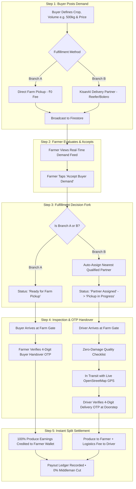

# KisanAI: Direct Farm-to-Buyer Agro-Commerce & Cold-Chain Logistics Platform

[](https://flutter.dev)
[](https://dart.dev)
[](https://firebase.google.com)
[](https://www.openstreetmap.org)
[](#)
[](LICENSE)

---

## Table of Contents
1. [Overview & Vision: Why "KisanAI"?](#1-overview--vision-why-kisanai)
2. [The 3-Sided Ecosystem](#2-the-3-sided-ecosystem)
3. [The 5-Step Shared Workflow](#3-the-5-step-shared-workflow)
4. [AI Quality Assaying & Statistical Crate Sampling](#4-ai-quality-assaying--statistical-crate-sampling)
5. [Anti-Fraud & "Crate Topping" Prevention](#5-anti-fraud--crate-topping-prevention)
6. [Financial Architecture & Automated Money Splitting](#6-financial-architecture--automated-money-splitting)
7. [Cash on Delivery (COD) & Floating Cash Management](#7-cash-on-delivery-cod--floating-cash-management)
8. [Maps, Navigation & GPS Sanitization](#8-maps-navigation--gps-sanitization)
9. [Tech Stack & Architecture](#9-tech-stack--architecture)
10. [Getting Started](#10-getting-started)

---

## 1. Overview & Vision: Why "KisanAI"?

Traditional agricultural supply chains in India force smallholder farmers to lose **30% to 40%** of their hard-earned produce value to physical middlemen, commission agents (*dalals*), grading rejections, and delayed 15-day credit cycles.

**KisanAI** fuses India's agricultural backbone (**Kisan**) with modern computational intelligence (**AI**):
* **"Kisan" (Farmer-Centricity):** Eliminates predatory middlemen. 100% of produce earnings are credited directly to the farmer's wallet with **0% platform commission**.
* **"AI" (Accessible Intelligence):** Powers voice search in **Tamil, Hindi, and English** for rural accessibility, intelligent market pricing, computer vision quality assaying, and smart logistics vehicle matching.

---

## 2. The 3-Sided Ecosystem

KisanAI seamlessly coordinates three distinct mobile interfaces in real time through Cloud Firestore:

| Stakeholder | Role in Ecosystem | Key Capabilities |
| :--- | :--- | :--- |
| **Buyer** | Wholesalers, retail vendors, institutions, end-buyers | Post bulk crop demands, track live GPS deliveries, inspect certified quality, direct farmer chat. |
| **Farmer** | Independent growers, FPOs, agricultural cooperatives | Accept broadcast demands, manage orders, direct farm gate sales, instant wallet cashouts via UPI/Bank. |
| **Delivery Partner** | Commercial agro-logistics fleet (Tata Ace Reefer, Bolero) | Cold-chain dispatch, 3-point produce damage inspection, doorstep OTP verification, trip earnings. |

---

## 3. The 5-Step Shared Workflow



### Fulfillment Decision Fork:
* **Branch A (Direct Farm Gate Pickup):**
  * Buyer travels directly to the farm.
  * **Zero delivery fees (₹0).** 100% of produce money goes to the farmer.
  * Verified via 4-digit buyer handover OTP at the farm gate.
* **Branch B (Integrated Logistics):**
  * Automatically matches vehicle capability to produce sensitivity:
    * **Tata Ace Reefer:** Active cold-chain refrigeration for perishables (tomatoes, berries).
    * **Mahindra Bolero Maxi Truck:** High payload ambient transit for bulk grains and bananas.

---

## 4. AI Quality Assaying & Statistical Crate Sampling

### How does the system grade 500 kg (~5,000 tomatoes)?
Neither humans nor machines scan thousands of tomatoes individually. KisanAI uses **Statistical Batch Sampling** (the industry-standard method used by clinical pathology and certified assayers):

1. **Representative Sampling:**
   * 500 kg tomatoes = **25 crates** (20 kg each).
   * 3 random crates are sampled (e.g., Crate #1, #12, and #25).
2. **Computer Vision Scan (YOLO / MobileNet):**
   * A single overhead photograph captures ~60 tomatoes on an inspection surface.
   * Analyzes:
     * **Color & Ripeness Index:** HSV spectrum (% uniform red vs breaker vs green).
     * **Size Uniformity (Caliber):** Millimeter diameter distribution (55mm–70mm for Grade A).
     * **Surface Blemishes:** Detects fungal spots, skin cuts, rot, or insect damage.
3. **Objective Digital Certification:**
   * Generates an unalterable digital quality score (e.g., *94.2% Grade A Certification*), preventing mandi middlemen from falsely claiming high-grade produce is defective.

---

## 5. Anti-Fraud & "Crate Topping" Prevention

**"Crate Topping"** is the traditional fraud where bad produce is hidden beneath a top layer of good produce. KisanAI completely eliminates this vulnerability through 4 structural layers:

1. **Random Core Sampling:** The driver selects an internal crate from the middle or bottom of the truck and tilts it into an inspection tray, exposing the bottom fruit.
2. **Mathematical Size-Disparity Checks:** The AI measures diameter variance. If Grade B tomatoes (38mm) are mixed into Grade A (65mm), the variance spikes, automatically downgrading the lot to *Mixed Grade B*.
3. **The Escrow & OTP Gate:** The farmer is **not paid upon loading**. Money stays locked in Escrow until the buyer unloads at destination. If bad produce was hidden, the buyer **refuses to provide the 4-digit OTP**, pausing settlement.
4. **Farmer Public Trust Score:** Repeat quality disputes lower the farmer's public rating (★ 1 to 5), revoking priority wholesale broadcasting privileges.

---

## 6. Financial Architecture & Automated Money Splitting

KisanAI uses an **RBI-compliant Escrow Model** similar to ride-hailing and food-delivery networks:

```
[Buyer Total Payment] ──► [KisanAI Digital Escrow Vault]
                                    │
               (Handover OTP Verified + Zero-Damage Inspection)
                                    │
           ┌────────────────────────┴────────────────────────┐
           ▼                                                 ▼
[Farmer Digital Wallet]                           [Driver Digital Wallet]
100% Produce Value                                100% Logistics Fee
(0% Platform Middleman Cut)                       (Instant Cashout via UPI)
```

### Real-World Example (500 kg Tomatoes):
* Produce Cost: **₹14,000**
* Logistics Trip Fee: **₹500**
* Total Buyer Payment: **₹14,500**
* **Step 5 Settlement Split:**
  * **Farmer receives:** **₹14,000** (Full produce price, 0% platform commission).
  * **Driver receives:** **₹425** (85% net fare after 15% platform aggregation cut).
  * **Platform Company revenue:** **₹75** (from logistics aggregation).

---

## 7. Cash on Delivery (COD) & Floating Cash Management

Carrying ₹14,000 to ₹1,00,000 in paper currency on highway routes creates theft risks. KisanAI handles COD through 3 safe channels:

1. **Dynamic Doorstep QR ("Digital COD"):** The driver presents a dynamic UPI QR code on arrival. The buyer scans via GPay/PhonePe directly into Escrow, unlocking the delivery OTP.
2. **Farm Gate Direct Cash (Branch A):** The buyer pays cash directly into the farmer's hands at the farm gate. Zero driver intermediary.
3. **Floating Cash Threshold & App Lock (For small physical cash collections):**
   * If a driver collects physical cash, their digital wallet balance becomes negative:
     $$\text{Wallet} = \text{Trip Fare} - \text{Cash Collected}$$
   * If the negative balance exceeds the **Floating Cash Limit (e.g. ₹8,000)**, the driver app **locks automatically**.
   * The driver cannot accept new orders until they remit the cash back via UPI or a bank Cash Deposit Machine (CDM).

---

## 8. Maps, Navigation & GPS Sanitization

* **OpenStreetMap Integration:** Standard OSM raster tiles (`tile.openstreetmap.org`) replace watermarked proprietary basemaps.
* **Geographic Sanitizer (`LocationDirectoryService`):**
  * Android emulators default to Mountain View, CA (`37.42, -122.08`), causing artificial 17,908 km overseas glitches.
  * `LocationDirectoryService.sanitize()` detects coordinates outside India and snaps them to verified Tamil Nadu agro hubs.
* **Realistic Road Circuity Modeling:**
  * Applies a `1.285x` highway circuity factor over straight-line haversine distance.
  * Accurately calculates real regional routes:
    * **Udumalpet $\to$ Ukkadam:** **~71.5 km** (ETA: ~107 mins @ 40 km/h).
    * **Pollachi $\to$ Gandhipuram:** **~44.0 km** (ETA: ~66 mins).

---

## 9. Tech Stack & Architecture

* **Frontend:** [Flutter](https://flutter.dev) (v3.x), Dart
* **Backend & Database:** [Google Firebase](https://firebase.google.com) (Cloud Firestore, Firebase Authentication, Cloud Functions)
* **Maps & GIS:** [flutter_map](https://pub.dev/packages/flutter_map) (OpenStreetMap), [latlong2](https://pub.dev/packages/latlong2), [geolocator](https://pub.dev/packages/geolocator)
* **State Management:** Provider & Reactive StreamBuilders
* **Fintech & Payouts:** Digital Escrow ledger, UPI integration, QR generation
* **Multilingual:** Custom zero-overhead memoized translation engine (`LanguageService`) supporting English, Tamil, and Hindi.

---

## 10. Getting Started

### Prerequisites
* Flutter SDK (`>= 3.3.0`)
* Dart SDK (`>= 3.3.0`)
* Android Studio / VS Code with Flutter extensions
* A configured Firebase project (`google-services.json` in `android/app/`)

### Installation & Run

1. **Clone the repository:**
   ```bash
   git clone https://github.com/your-username/KisanAI.git
   cd KisanAI/APP
   ```

2. **Install dependencies:**
   ```bash
   flutter pub get
   ```

3. **Verify code integrity:**
   ```bash
   dart analyze lib
   ```

4. **Run automated unit tests:**
   ```bash
   flutter test test/location_and_workflow_test.dart
   ```

5. **Launch the application:**
   ```bash
   flutter run
   ```

---

## License

This project is licensed under the MIT License - see the [LICENSE](LICENSE) file for details.
# KisanLinkAI

